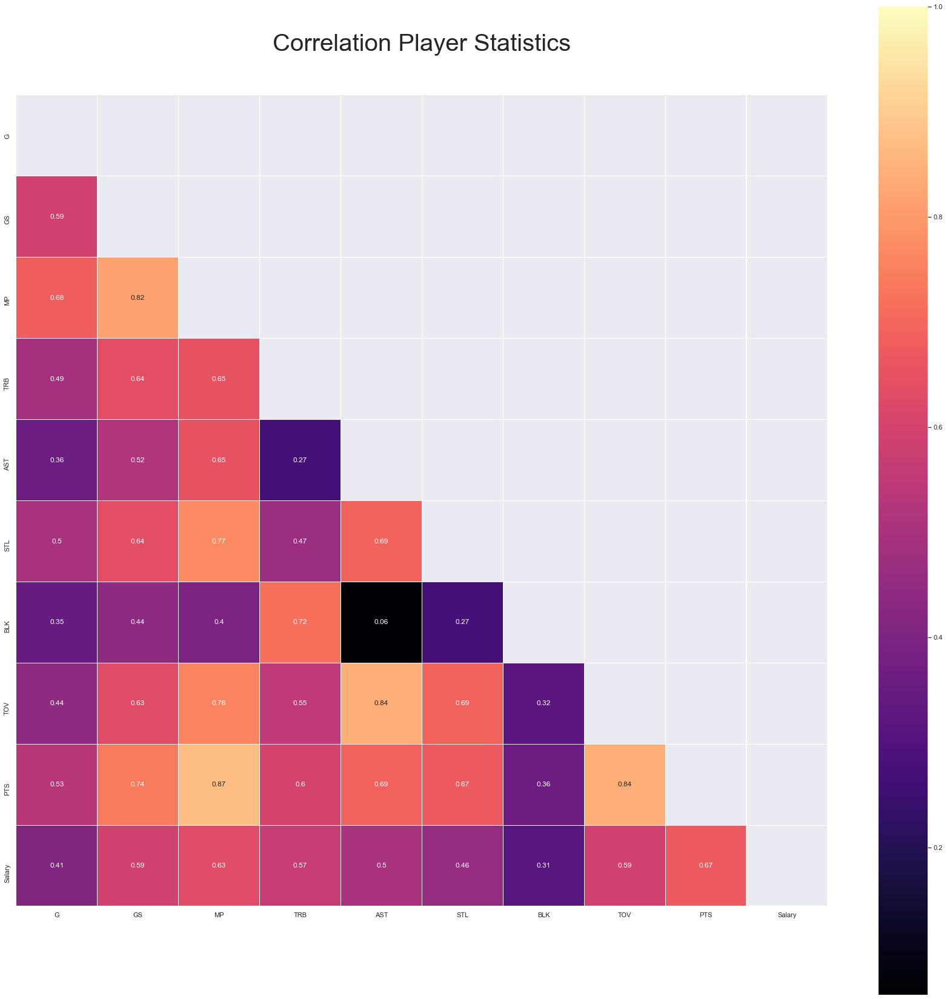
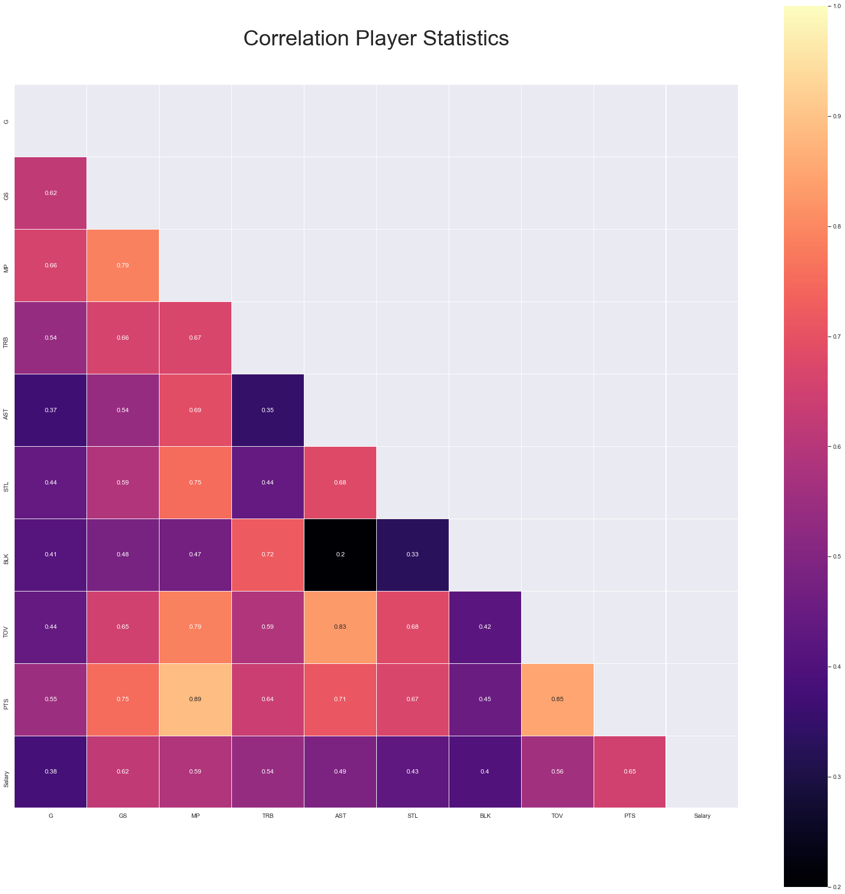
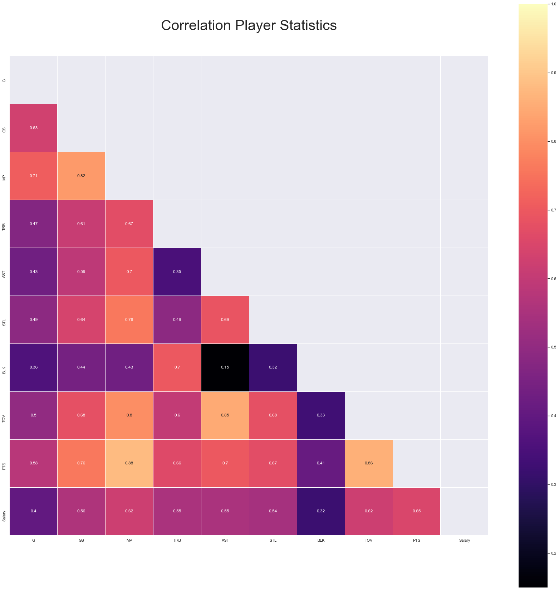
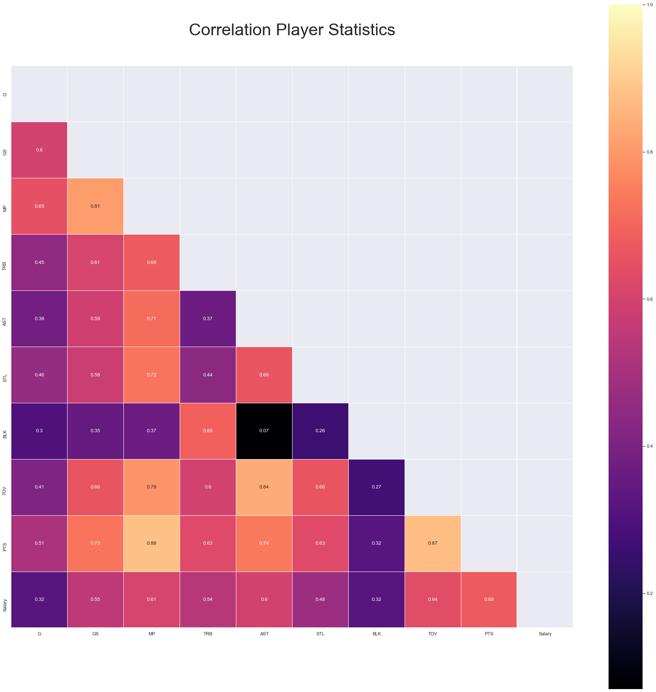
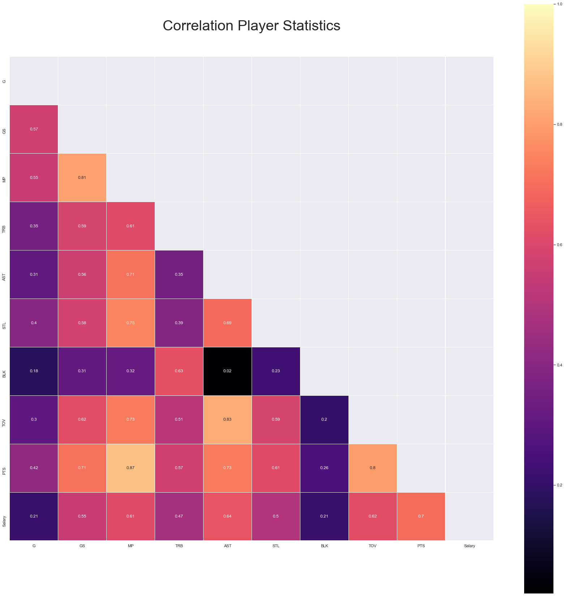
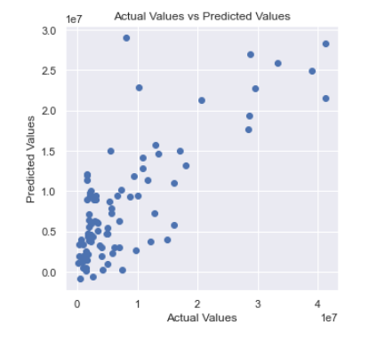
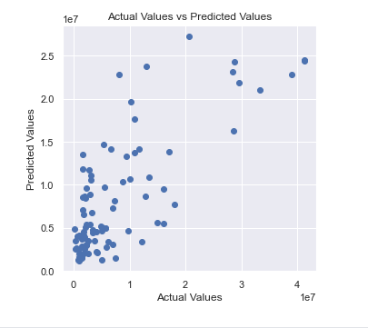

# Video Presentation 

<figure class="video_container">
   <iframe width="560" height="315" src="https://www.youtube.com/embed/D7kogk-5xRI" title="YouTube video player" frameborder="0" allow="accelerometer; autoplay; clipboard-write; encrypted-media; gyroscope; picture-in-picture" allowfullscreen></iframe>
</figure>


# Introduction
The National Basketball Association is known to be one of the most lucrative professional sports in the world. The NBA athlete's salary has increased over the years and the athlete's contracts have been a topic of interest among many sports fans. There is a sea of data available about the NBA player’s ranking, scores, positions, and contracts. The intriguing question is what factors play the most important part in the decision of an NBA player’s salary. Our team has decided to attempt to answer this question through our project.


# Problem Definition
The salary cap and the luxury tax in the NBA will reach $113 and $136 million respectively for the 2021-2022 season. This puts substantial constraints on managers and coaches in trying to build a competitive team within these strict limitation. Thus, a model able to predict appropriate players’ salaries is crucial to the league. 
In this project we will use players’ data and stats from the past 5 seasons - as salaries have dramatically risen compared to earlier years - to find which ones are most correlated to salary and then predict the potential cap hit for the 2021-2022 season. The goal of this project is to provide reasonable recommendations to both players and teams regarding their intrinsic value based on their on-court performance.

# Methods

We scraped data from basketball-reference.com which a historical and up to date repository for statistics for the NBA. To constrain the data set, we will only be considering signed, non-rookie contracts over the past 5 years for salary prediction. For cleaning data, we will consider each players average across the following statistics: Points Per Game(PPG), Minutes Played Per Game (MPG), Rebounds Per Game (RPG), Assists Per Game(APG), Blocks (BLK), Steals (STL), Turnovers(TOVR) mapping each to the player’s salary. We are using a linear regression model for the current 2020-21 season to identify the stat correlations that are most correlated to salary prediction and are using those stats to predict future contract offers. We are next using the average of all seasons to standardize over the 5 years for the found data and will perform the same linear predictive analysis along with using K-Nearest Neighbors to classify the players which are underpaid yet statistically over performing or vice versa.

# Data Cleaning
We cleaned the retrieved data in removing players from the data set with missing stat information or not having salary information. Additionally, we removed any players with names containing special characters not conforming to alphanumeric UTF-8 characters.

# Results and Discussion
For this project, we expect to have a machine learning algorithm that is able to predict what an NBA player’s salary should be as a percentage of the overall salary cap. This predictor could be used a way for general managers to find the best way to optimize their team with respect to getting the most talent, skill, and highest chance to win with the least amount of money spent. In a league like the NBA where there is a salary cap, it is very important to be efficient with the salaries so that you have more resources on the court than your opponent.

1. Data Pre-Processing

   After scraping the data we decided to look into the statistics for the 2021 season of the NBA disregarding players who signed a rookie contract within this time frame. In order to select the most relevant statistics we decided to run a Pearson Correlation done through the following tables:
   
   <h3>2016-17</h3>

   
   <h3>2017-18</h3>

   
   <h3>2018-19</h3>

   
   <h3>2019-20</h3>

   
   <h3>2020-21</h3>

   
   
   We then took into consideration solely the statistics that had a high correlation with salaries _(correlation > 0.6)_ as follows:
   ```python


   #identify features that are highly correlated (0.6 >)
   salary_corr = abs(corr["Salary"])
   pos_corr = salary_corr[salary_corr > (0.6)]
   #drop features that are less correlated(<0.6)
   stats.drop(['GS','G','TRB','STL', 'BLK'], axis=1, inplace=True)
   pos_corr
   MP        0.61
   AST       0.64
   TOV       0.62
   PTS       0.70
   Salary    1.00
   Name: Salary, dtype: float64
   ```
2. Linear Regression

   Based on the above data, we created training(80%) and test(20%) data set. Then we made linear regression Model and calculated predictions on the data. R squared    value was 
   used to interpret regression model fitting the observed data. With the r-squared of 59.69 ≈ 60% we can concluded that about 60% of the data fit the regression      model.

   ```python
   #Linear Regression to Predict Salary
   reg = LinearRegression()
   reg.fit(x_train, y_train)
   y_prediction = reg.predict(x_test) 
   r2_score(y_test, y_prediction)
   0.5969246358948748
   ```
   To visualise the predicted results, we created a scatter plot for actual vs predicted values. The following plot shows that the values have positive correlation: 
   
   
   
2. Random Forest Regression
   
   
# References
Papadaki, Ioanna, and Michail Tsagris. “Estimating NBA Players Salary Share According to Their Performance on Court: A Machine Learning Approach.” ArXiv.org, 31 Oct. 2020.

Késenne, Stefan. “The Impact of Salary Caps in Professional Team Sports.” Wiley Online Library, John Wiley & Sons, Ltd, 7 Jan. 2003. 

Wu, William, Feng, Kevin, Li, Raymond et al. “Classification of NBA Players through Player Statistics” Sports Analytics Group Berkeley, 2018.

Borghesi, Richard. “An Examination Of Prediction Market Efficiency: Nba Contracts On    Tradesports.” The Journal of Prediction Markets, vol. 3, no. 2, 2012, pp. 65–77.,    doi:10.5750/jpm.v3i2.462. 

Stiroh, Kevin J. “Playing For Keeps: Pay And Performance In The Nba.” Economic Inquiry,    Vol. 45, No. 1, 2007, Pp. 145–161., Doi:10.1111/J.1465-7295.2006.00004.X. 
