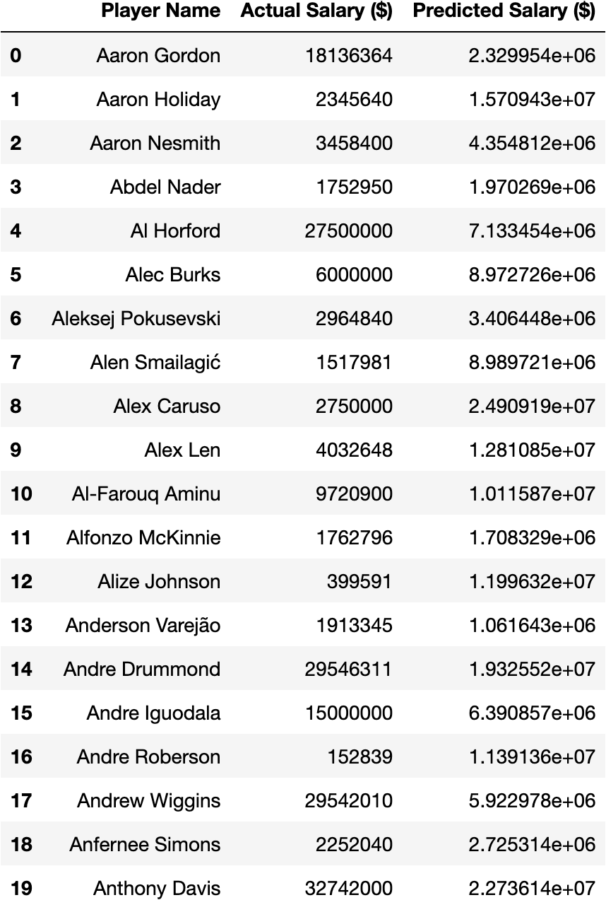
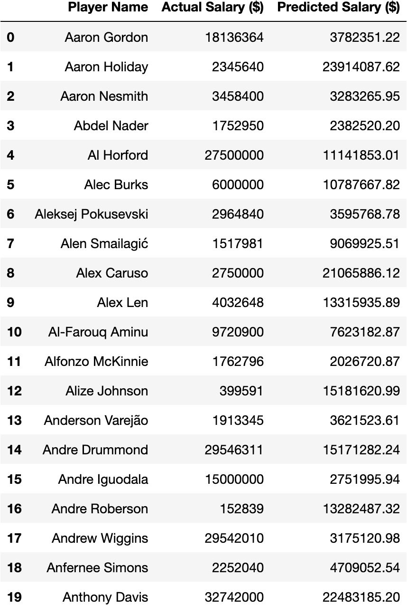
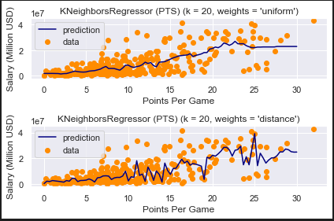
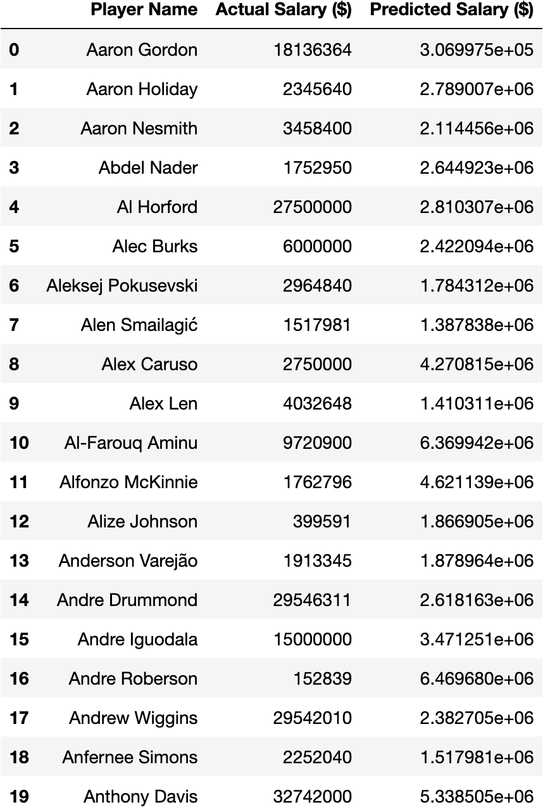
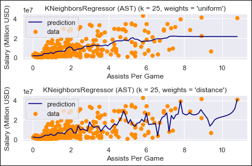
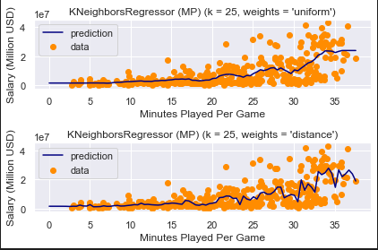
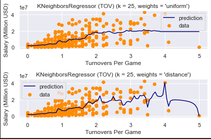

# Predicting NBA Salaries


## Introduction
The National Basketball Association is known to be one of the most lucrative professional sports in the world. The NBA athlete's salary has increased over the years and the athlete's contracts have been a topic of interest among many sports fans. There is a sea of data available about the NBA player’s ranking, scores, positions, and contracts. The intriguing question is what factors play the most important part in the decision of an NBA player’s salary. Our team has decided to attempt to answer this question through our project.


## Problem Definition
The salary cap and the luxury tax in the NBA will reach $113 and $136 million respectively for the 2021-2022 season. This puts substantial constraints on managers and coaches in trying to build a competitive team within these strict limitation. Thus, a model able to predict appropriate players’ salaries is crucial to the league. 
In this project we will use players’ data and stats from the past 5 seasons - as salaries have dramatically risen compared to earlier years - to find which ones are most correlated to salary and then predict the potential cap hit for the 2021-2022 season. The goal of this project is to provide reasonable recommendations to both players and teams regarding their intrinsic value based on their on-court performance.

## Methods

We scraped data from basketball-reference.com which a historical and up to date repository for statistics for the NBA. To constrain the data set, we will only be considering signed, non-rookie contracts over the past 5 years for salary prediction. For cleaning data, we will consider each players average across the following statistics: Points Per Game(PPG), Minutes Played Per Game (MPG), Rebounds Per Game (RPG), Assists Per Game(APG), Blocks (BLK), Steals (STL), Turnovers(TOVR) mapping each to the player’s salary. We are using a linear regression model for the current 2020-21 season to identify the stat correlations that are most correlated to salary prediction and are using those stats to predict future contract offers. We are next using the average of all seasons to standardize over the 5 years for the found data and will perform the same linear predictive analysis along with using K-Nearest Neighbors to classify the players which are underpaid yet statistically over performing or vice versa.

## Data Cleaning
We cleaned the retrieved data in removing players from the data set with missing stat information or not having salary information. Additionally, we removed any players with names containing special characters not conforming to alphanumeric UTF-8 characters.

## Results and Discussion
For this project, we expect to have a machine learning algorithm that is able to predict what an NBA player’s salary should be as a percentage of the overall salary cap. This predictor could be used a way for general managers to find the best way to optimize their team with respect to getting the most talent, skill, and highest chance to win with the least amount of money spent. In a league like the NBA where there is a salary cap, it is very important to be efficient with the salaries so that you have more resources on the court than your opponent.

1. Data Pre-Processing

   After scraping the data we decided to look into the statistics for the 2021 season of the NBA disregarding players who signed a rookie contract within this time frame. In order to select the most relevant statistics we decided to run a Pearson Correlation done through the following tables:
   
   <h3>2016-17</h3>

   
   <h3>2017-18</h3>

   
   <h3>2018-19</h3>

   
   <h3>2019-20</h3>

   
   <h3>2020-21</h3>

   
   
   We then took into consideration solely the statistics that had a high correlation with salaries _(correlation > 0.6)_ as follows:
   ```python


   #identify features that are highly correlated (0.6 >)
   salary_corr = abs(corr["Salary"])
   pos_corr = salary_corr[salary_corr > (0.6)]
   #drop features that are less correlated(<0.6)
   stats.drop(['GS','G','TRB','STL', 'BLK'], axis=1, inplace=True)
   pos_corr
   MP        0.61
   AST       0.64
   TOV       0.62
   PTS       0.70
   Salary    1.00
   Name: Salary, dtype: float64
   ```
2. Linear Regression

After preprocessing the data and dropping features that are not highly correlated to the player's salary, we implemented linear regression using scikit learn to predict the player's salary. We split our data into training and test sets. 20% was used for testing and the remaining 80% was for training. Then we predicted the salary with regression. R squared value was used to interpret regression model fitting the observed data. The r-squared of value is 59.69% and the mean absolute error is 4318229.55

   ```python
   #Linear Regression to Predict Salary
   reg = LinearRegression()
   reg.fit(x_train, y_train)
   y_prediction = reg.predict(x_test) 
   r2_score(y_test, y_prediction)
   0.5969246358948748
   ```
   Mean Absolute Error:
   ```
   mae = mean_absolute_error(y_test, y_pred)
   ```
   => 4318229.546937237
   
   To visualise the predicted results, we created a scatter plot for actual vs predicted values. The following plot shows that the values have positive correlation: 
   
   
   
   The table below shows the actual versus predicted dollar values of a sample of players through Linear Regression:
   
   
   
   Knowing that the relationship between a player's statistics and their salary is not perfectly linear we decided to implement two other predictors, Random Forest and K-Nearest Neighbors, below we can find the implementations and representative results.
   
3. Random Forest Regression

Similar to Linear regression model, we used 20% of the data for test and 80% for training set in the Random Forest Regression. The R-squared value is 0.567 and the mean absolute error is 4501875.42

   ```python
   #test(20%) and train(80%)
   x = stats.drop("Salary", 1)
   print(x)
   y = stats["Salary"]
   x_train,x_test, y_train, y_test = train_test_split(x, y, test_size = 0.2, random_state = 0)
   regressor = RandomForestRegressor()
   regressor.fit(x_train, y_train)
   y_pred = regressor.predict(x_test)
   r2_score(y_test, y_pred)
   0.566534606214592
   ```
   Mean Absolute Error:
   ```
   mae = mean_absolute_error(y_test, y_pred)
   ```
   
   =>4501875.422087912


   
   
   Here are some representative results from Random Forest Regression:
   
   
   
4. K-Nearest Regresssion
   ```python
   #K nearest neighbor regression to predict salary from points per game
   from sklearn import neighbors
   n_neighbors = 3
   T = np.linspace(0, 30, 91)[np.newaxis,:]
   T = T.reshape(-1,1)
   X = x_train['PTS']
   X = X.to_numpy(X)
   X = X.reshape((-1,1))
   Y = y_train.to_numpy(y_train)
   Y = Y.reshape(1,-1)
   Y = Y.ravel()

   for i, weights in enumerate(['uniform', 'distance']):
       knn = neighbors.KNeighborsRegressor(n_neighbors, weights=weights)
       y_ = knn.fit(X, Y).predict(T)
       plt.subplot(2, 1, i + 1)
       plt.scatter(X, Y, color='darkorange', label='data')
       plt.plot(T, y_, color='navy', label='prediction')
       plt.axis('tight')
       plt.legend()
       plt.title("KNeighborsRegressor (PTS) (k = %i, weights = '%s')" % (n_neighbors,
                                                                   weights))
       plt.xlabel("Points Per Game")
       plt.ylabel("Salary (Million USD)")

   plt.tight_layout()
   plt.show()
   ```
   
   
   Below we can find some predicted values through K-Nearest Neighbors with respect to players' Points per Game:
   
   
   
 Here are the K-Nearest graphs for assists per game, minutes played per game, and turnovers per game:
   
   
   
   
   

## Discussion and Conclusions

The objective of this study was to provide a prediction of an NBA player's true salary based on his most relevant statistics in order to facilitate both players and franchises during potential contract negotiations. We decided to use three different models as predictors: Linear Regression, Random Forest and K-Nearest Neighbors. All three predictors show consistent linearity between actual and predicted values, with an approximate Mean Absolute Error of $4 million. 
<br>
The obtained results are promising however better accuracy could be achieved through the use of a wider range of statistics and their possible normalization as certain statistics prove to be more relevant than others in predicting players' salaries given their position, experience and impact not only on but also off the court.
<br>
In conclusion, with the time and data restrictions the model is fairly robust as the error in predicting salary is significant but not to the point where it makes the result incoherent. We decided to use only the last 5 years worth of data as salary inflation as risen dramatically compared to the seasons prior to 2016. Our suggestion would be to normalize the data more with respect to players positions as the relevant stats that factor into salary decisions are also heavily impacted by this.
## References
Papadaki, Ioanna, and Michail Tsagris. “Estimating NBA Players Salary Share According to Their Performance on Court: A Machine Learning Approach.” ArXiv.org, 31 Oct. 2020.

Késenne, Stefan. “The Impact of Salary Caps in Professional Team Sports.” Wiley Online Library, John Wiley & Sons, Ltd, 7 Jan. 2003. 

Wu, William, Feng, Kevin, Li, Raymond et al. “Classification of NBA Players through Player Statistics” Sports Analytics Group Berkeley, 2018.

Borghesi, Richard. “An Examination Of Prediction Market Efficiency: Nba Contracts On    Tradesports.” The Journal of Prediction Markets, vol. 3, no. 2, 2012, pp. 65–77.,    doi:10.5750/jpm.v3i2.462. 

Stiroh, Kevin J. “Playing For Keeps: Pay And Performance In The Nba.” Economic Inquiry,    Vol. 45, No. 1, 2007, Pp. 145–161., Doi:10.1111/J.1465-7295.2006.00004.X. 
